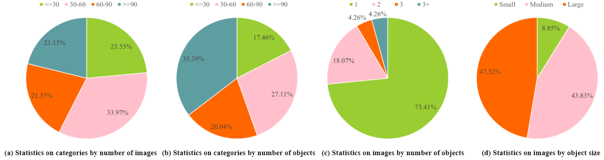

# 
Logo4500: Large-scale Dataset and a Benchmark for Advancing Logo Detection 

## Logo4500-Dataset

## Logo4500 Dataset Description
In this work, we introduced logo4500, the largest fully annotated logo-detection dataset, with 4,500 logo categories, more than 420,000 manually annotated logo objects, and 293,298 images. Logo4500 creates a more challenging benchmark for Logo detection because it has higher overall coverage and wider diversity in terms of flag categories and annotation objects than existing datasets. The statistical comparison of the 10 superclasses in Logo4500 is as follows:

| Category | Number | Image | Object | Pencentage | Content |
|-----|-----|-----|-----|-----|-----|
| Food | 926 | 67,768 | 102,308 | 20.68% | Eggs, Dairy, Meat, Condiment, Fast food, Snack|
| Clothing | 752 | 42,985 | 50,341 | 16.94% | Dress, Shoes, Underwear, Hat |
| Toiletry | 480 | 35,380 | 58,976 | 10.81% | Cosmetic, Dentifrice, cleansing lotion, Shower Gel |
| Drink | 339 | 23,764 | 39,272 | 7.64% | Liquor, Fruit Juice, Portable water, Beverage |
| Electronics&Software | 313 | 19,535 | 29,182 | 7.09% | Computer, Phone, Audio, Software, Switch |
| Catering&Accommodation | 268 | 14,762 | 18,887 | 6.04% | Restaurant, Hotel, Café, Dessert Shop |
| Vehicle | 189 | 11,289 | 14,603 | 4.26% | Car, Bicycle, Motor, Plane |
| Sport&Amusement | 161 | 9,317 | 12,392 | 3.63% | Sporting equipment, Toy, Game  |
| Others | 147 | 6,033 | 6,598 | 3.29% | Not included in Nice classification(e.g., Music,Anime) |
| Medicine&Hygiene& | 115 | 12,901 | 22,310 | 2.59% | Medicine, Nutrient, Tissue, Disinfectant |

## Category Hierarchy for Logo4500
The figure shows the category hierarchy of Logo4500, which belongs to 37 different superclasses in the Nice classification system.

## Logo4500 Dataset Detailed Statistics
The figure showns the detailed statistics of Logo4500 about Image and object distribution in per category, and the number of objects in per image and object size in per image.

The sorted distribution of images for each logo in Logo4500 is shown the figure. We can see that imbalanced distribution across different logo categories are one characteristic of Logo4500, posing a challenge for effective logo detection with few samples.

In addition, we performed a quantitative comparative analysis of these two datasets, Logo4500 and LogoDet-3K.

## Download Dataset
This dataset can be obtained by sending a request email to us. Specifically, the researchers interested in it should download and fill up this [Agreement Form](https://github.com/housujuan123/Logo4500/blob/main/Agreement%20and%20Disclaimer.pdf) and send it back to us (327484632@qq.com; Email title: Logo4500 dataset request). We will then send you the download instructions.

## Code & Trained Models
You can download codes and trained models from here.
